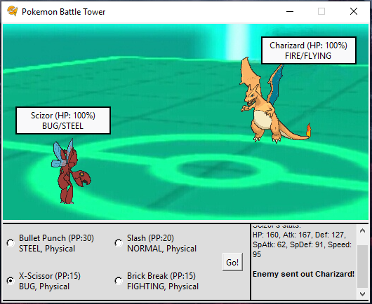

# pokemon-battle-tower
A Pokemon battle simulator-game written in python in order to learn how to use TKinter.
In order to win the game, the player must defeat the computer in 3 consecutive battles.
The opponent will be harder to beat after each win, using better AI principles:
 * Heuristic function is used to pick better suited pokemons to beat the player's pokemons.
 * Modified MiniMax algorithm is used to choose the best possible attack to defeat the player's pokemons.

### Notice for pokemon-fans:
Don't expect to see all 700+ existing pokemons in the game. I chose only some of my favorite pokemons to the game, so each pokemon-type will have 1-3 different pokemons. Same goes for attacks - I chose only a few attacks, mainly so each type will get at least one same-type-attack-bonus.

The game simulates Gen2 battles with Physical/Special split, means no Abilities/Mega-Evolutions etc... 

#### P.S, keep in mind that the game was programmed for fun :)

